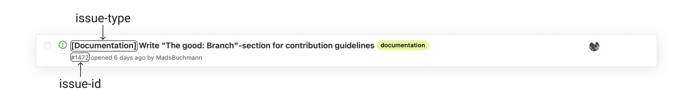
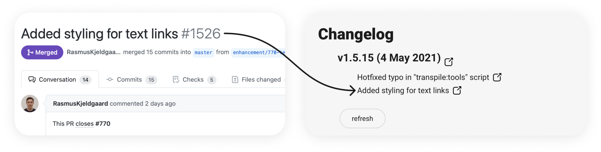
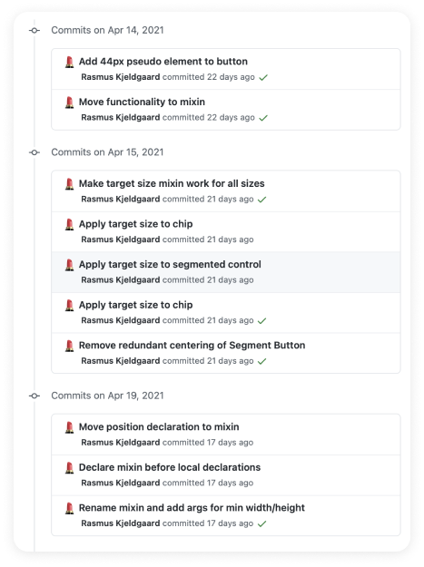

<!-- We should probably link to this file in #kirby-guild -->
First of all - thank you for your interest in contributing to Kirby! 🥳
<!-- Early on show that we are here to help if necessary and to educate people in how to get help -->
If you at any point have any questions please read: [I have a question related to Kirby](#i-have-a-question-related-to-kirby)

**Beware:** We reserve the right to close issues and pull-requests that does not follow the steps outlined in [the contribution model](#the-contribution-model). This is not because we want to be mean or micro-manage the way things are done - but a project of this size requires some consistency in the way we cooperate in order to be manageable. 

* [Introduction to the contribution model](#introduction-to-the-contribution-model)
  + [The process of contributing](#the-process-of-contributing)
  + [Before you get coding](#before-you-get-coding)
  + [Checklist: I have a component request](#checklist-i-have-a-component-request)
  + [Checklist: I have an enhancement](#checklist-i-have-an-enhancement)
  + [Checklist: I have found a bug](#checklist-i-have-found-a-bug)
* [Setup environment and tooling for contribution](#setup-environment-and-tooling-for-contribution)
  + [Clone and install repository](#clone-and-install-repository)
  + [Node](#node)
  + [Tslint](#tslint)
  + [Prettier](#prettier)
* [The good:](#the-good:)
  + [Issue](#issue)
  + [Branch](#branch)
  + [Commit](#commit)
  + [Self-review](#self-review)
  + [Pull-request](#pull-request)
  + [Test](#test)
* [I have a question related to Kirby](#i-have-a-question-related-to-kirby)
  + [Submit an inquiry request on github](#submit-an-inquiry-request-on-github)
  + [Ask in the kirby-guild slack channel](#ask-in-kirby-guild)
* [Glossary](#glossary)
  + [Tech Refinement](#tech-refinement)
  + [UX review](#ux-review)
  + [Self review](#self-review)

## Introduction to the contribution model

<!-- Introduction and motivation -->
Despite Kirby stemming from an internal Bankdata project - it has been decided to open source it, such that others than team Kirby can contribute to it. 
Allowing for Kirby to be used in multiple projects without team Kirby being the bottleneck. 

If you have a problem, an issue you want resolved, or even got brand new ideas for components. Well. There is no need to sit around and wait for team Kirby to get it implemented. 
You can contribute yourself! And no matter your role, you can probably contribute with something. May it be a helpful comment or a bug report.

We think that is neat. 

There is still need for managing Kirby however. We need to make sure that the project is moving in the right direction. That submitted code is: high quality, not duplicating anything and consistent with the rest of the codebase.
To do so a series of steps has been created that an issue must go through. All of these aim at making sure that the process of cooperating from idea to implementation is smooth for contributors. With as little time wasted as possible.

> Simplicity—the art of maximizing the amount of work not done—is essential.
>  
> _[Principles behind the Agile Manifesto](https://agilemanifesto.org/principles.html)_

### The process of contributing

<!-- General description of the contribution model -->

In broad strokes the process is:

1. Submit an issue
2. Get it refined
3. Implement a solution
4. Get the solution reviewed and approved

Once a pull-request has been approved it will be automatically merged. 

Actionable checklists for these steps can be found [here](#checklist-i-have-a-component-request). The following highlight some of the steps in the checklists, to explain what they are and why they exist. Our experience is that pull-requests with a troublesome and drawn out review process have not followed one or more of these steps. 

<!-- Why we do UX refinement?-->

#### UX Refinement

> Planning and deciding how the issue can be solved in a way that aligns with the design system visually and UX-wise.

Every issue must be UX refined before implementation - unless it does not involve any visual changes. This consists of UXers planning how the issue can be solved in a way that aligns with the design system. The `NOT UX refined` label will be removed from the issue by team Kirby, once this has been done.

If a pull-request with visual changes is submitted for an issue that has not been UX refined; the UX review process may result in a bunch of changes, that can delay the process of getting your PR approved.

<!--- Why do we do Tech refinement? -->

#### Tech Refinement

> Discussion and agreement on technical solution(s) for the implementation of the issue.

Every issue must be tech refined. Here it is discussed and agreed on how an issue should be implemented the best; the agreed upon solution should be documented in a comment on the issue. How long it takes depends on the scope of the issue. For small issues it might be nothing more than an agreement via a direct message. Other times it is a full-blown meeting with multiple participants.

⚠️ _No code should be written before this step is complete_.

Once the issue has been properly tech refined Team Kirby will remove the `NOT Tech refined` label from the issue. If a pull-request is submitted for an issue that has not been tech refined; changes and problems that could have been tackled from the beginning, might arise from the code-review.

#### Publish a WIP draft

> Draft pull-request intented for getting timely feedback before too much implementation has been done.

We encourage contributors to publish a draft pull-request with a WIP implementation of their issue to get feedback. This can advantageously be done before tests are written. By doing this misunderstandings and issues can be tackled early on; here they are often easier to correct. If this is not done, they might not be discovered until the code-review. Tests might have to be changed. So therefore we encourage contributors to use the opportunity to get some timely feedback.

<!-- Why do a self-review? -->

#### Self-review

> Reviewing your own pull-request like you would review someone else's pull-request.

This consists of code-reviewing your own pull-request, following guidelines found in [The good: Self-review](#self-review). This is your chance to catch any low-hanging fruits and common issues before the reviewer does. If this is not done, an unneccessary amount of minor changes might be required during code review. This wastes both yours and the reviewers time.

<!-- Why we do UX reviews? -->

#### UX review

> Confirmation from UXers that the implementation complies with what was decided during UX Refinement.

If the implementation of the issue resulted in visual changes - then it has to be UX reviewed. This is to make sure that the introduced changes align with the design system. We strive to have every issue that introduces visual changes UX reviewed. If this is not done and the changes are merged to master, we might recieve issues about components not being properly aligned with the design system anymore from the users of Kirby.

<!-- - Issues for trackability and history -->

### Before you get coding

Skim through the "[The good](#the-good)"-section. We are a lot of people working together on this project, all with varying prefrences both in terms of how we work and code. This might lead to frustrations during code-reviews. In an effort to avoid this and be transparent; we have specified our preferences on various subjects in that section. 

Alternative ways of doing things are not wrong. But we strive for consistency across the Kirby codebase. 

You should also get properly setup before you write any code. To do so have a look at: "[Setup environment and tooling for contribution](#setup-environment-and-tooling-for-contribution)".

<!-- The following "I have/would" sections has the role of easily guiding the reader 
on how to do their specific task, and explain them what the process is for that task -->

### Checklist: I have a component request 

<!--- Submit issue using the component request template--> 
If you got an idea for a component that you think should be part of Kirby you should follow these steps: 

1. **Open a [new issue](https://github.com/kirbydesign/designsystem/issues/new/choose) using the "component request"-template** (See guidelines on how to write "[The good: Issue](#issue)").
2. **Refinement:**
    - Request that the issue is [UX refined](#ux-refinement) in [#kirby-guild](#getting-access-to-the-kirby-guild-slack-channel); do not proceed until this is done.
    - Request that the issue is [tech refined](#tech-refinement) in [#kirby-guild](#getting-access-to-the-kirby-guild-slack-channel); do not proceed until this is done.
    - Move the issue to the "Ready to do"-column in the "[Kirby kan-ban board](https://github.com/kirbydesign/designsystem/projects/1)"-project.
3. **Implementation:**
    - Make sure you have read: "[Before you get coding](#before-you-get-coding)".
    - Signal to others you are working on the issue by assigning yourself.
    - Create a "feature"-branch from the [master branch](https://github.com/kirbydesign/designsystem/tree/master). 
    - Publish a WIP implementation to Github as a draft PR and ask [#kirby-guild](#getting-access-to-the-kirby-guild-slack-channel) for feedback. <!--This will let you know early on if you are going in the right direction.-->
    - Make sure you have implemented tests following the guidelines in: "[The good: Test](#test)".
    - Update the [cookbook](https://cookbook.kirby.design) with examples and showcases.
4. **Review:**
    - Do a [self-review](#self-review). 
    - Create a pull-request. If you created a draft PR in step 3 you can just mark that as "ready for review".
    - Request that the pull-request is code-reviewed in [#kirby-guild](#getting-access-to-the-kirby-guild-slack-channel).
    - Request that the pull-request is [UX reviewed](#ux-review) in [#kirby-guild](#getting-access-to-the-kirby-guild-slack-channel).
    - When the pull-request has been approved it will be automatically merged to master via [automerge](https://docs.github.com/en/github/collaborating-with-issues-and-pull-requests/automatically-merging-a-pull-request).
5. **Celebrate! 🎉**

### Checklist: I have an enhancement 

If you have an idea for Kirby that is not a brand new component or aimed at improving code quality; then you should submit an enhancement request!
The process is the same as submitting a component request just using another issue-template: 

1. **Open a [new issue](https://github.com/kirbydesign/designsystem/issues/new/choose) using the "enhancement request"-template** (See: "[The good: Issue](#issue)").
2. **Follow steps 2 to 5 in "[Checklist: I have a component request](#checklist-i-have-a-component-request)".**

### Checklist: I have found a bug 

If you have found a bug in Kirby you should follow these steps: 

1. **Report it by opening a [new issue](https://github.com/kirbydesign/designsystem/issues/new/choose) using the "bug report"-template** (See: "[The good: Issue](#issue)").
2. **Get the bug verified** 
    - To make sure the bug is not intended behaviour contact [#kirby-guild](#getting-access-to-the-kirby-guild-slack-channel) to have it verified; do not proceed until this is done. 
3. **Implementation:** 
    - Signal to others you are working on the issue by assigning yourself.
    - Create a "fix"-branch from the [master branch](https://github.com/kirbydesign/designsystem/tree/master). 
    - Create a test that reproduces the bug following guidelines in: "[The good: Test](#test)". 
    - Write code to fix the bug
4. **Follow steps 4 and 5 in "[Checklist: I have a component request](#checklist-i-have-a-component-request)".**

## Setup environment and tooling for contribution

<!-- The following section is responsible for teaching people how to get setup with 
the repo such that they can get coding -->

### Clone and install repository 

* how to clone and get going with the kirby repo

### Node 

* Which version should people use, and perhaps a recommendation on which tool people can use to manage versions. 

### Tslint 

* People should make sure to have it enabled to avoid unnecessary comments during code review

### Prettier

* It is a good idea to use format-on-save

## The good:

<!-- The following sections have the responsibility of explaining contributors our best pratices such that they can more easily have their changes implemented in kirby --> 
<!-- Ideally we should be able to refer to these sections if people break the guidelines in their issue or pull-requests, to make sure we are all preaching the same guidelines -->

### Issue 

> A good idea is an orhpan without effective communication. 
>  
> _Topic 7, The Pragmatic Programmer_

Writing a good issue is all about effective communication. This leads to fewer questions and discussions, which in turn results in a quicker process from new issue to approved PR. 

The following is a series of points that we believe can help to communicate more effectively when writing issues. 

#### The good issue only contains one issue

While this might seem obvious it can be easy to fall into the trap of bundling two issues together. 

Consider the following issue: 

> Hovering a `kirby-button` with attention level 2 in IE11 does not activate the hover-effect. It works when i use attention level 1, but i get warnings in the console.

If that issue is closed, how is the reader supposed to know what was actually fixed? 
Was it the issue of the hover-effect not activating? The issue of warnings being thrown when using attention level 1? Both? 

To solve this, the issue should be split into two seperate issues which refer to each other: 

Issue #1:

> Hovering a `kirby-button` with attention level 2 in IE11 does not activate the hover-effect. This might be related to issue #2.

Issue #2:

> I am not able to use a `kirby-button` with attention level 1 without a warning being thrown in the console. This might be related to issue #1.

If you feel like you are "complaining" too much by creating several issues; don't! 
It is only helpful of you to split up your issues - you are saving time and easing organization. 

#### The good issue is self-contained 

It can not be assumed that the reader of your issue has any knowledge of your work outside of Kirby. 

The reader might be: 

* a contributor outside of Bankdata 
* someone who is not in your team 
* potentially a new hire

This also goes for Kirby maintainers - some of which has been hired to specifically work on Kirby. 

Therefore: 

* Do not use internal lingo 
* Do not assume the reader can access the application you are working on - include screenshots instead.
* Do not assume the reader can access the repository you are working in - include code snippets instead (if possible). 

#### The good issue is specific & unambigious

The wording of an issue should be as specific and unambigious as possible. This will help the reader understand exactly what you mean. This can be done in many ways. Therefore we have compiled some examples to demonstrate:

##### Example #1: Referring to files 

If you are referring to a file in the repository do not refer to it as `_typography.css` use the full path instead: `libs/designsystem/src/lib/scss/base/_typography.scss` .

It can also be helpful to directly link to the file such that the reader easily can access it: [ `libs/designsystem/src/lib/scss/base/_typography.scss` ](https://github.com/kirbydesign/designsystem/blob/master/libs/designsystem/src/lib/scss/base/_typography.scss).

While it might be obvious for you and experienced contributors, what and where `_typography.css` is; it is not obvious for newcomers. 

If you already have refered to the full path earlier in the issue, it is okay to refer to the file as `_typography.css` without linking to it.

##### Example #2: Writing reproducible steps for bug reports

The steps should be unambigously specific. This can be done for example by changing the step: 

> 2. Type some text 

to: 

> 2. Type: 'text'

 
There could be something with the _exact_ way you are doing it, that triggers the behaviour you are experiecing. 

##### Example #3: Using code snippets to explain what and how

When reporting a bug or similar do not write something along the lines of: 

> Whenever i use a `kirby-button` with attention level 1 on the frontpage, a warning is thrown

Specify exactly where and how the button is inserted with a code snippet, along with exact details of the warning and where it can be found:

> Inserting a `kirby-button` with attention level 1 as shown in the code-snippet, results in the following warning being logged in the browser console: `TypeError: undefined is not an object` .

The latter is pure maintainer poetry. 

These are but three examples of how issues can be specific and unambigious. Always keep in the back of your mind, how you can be more specific and unambigious when describing issues. 

#### The good issue follows the template 

Do not ignore the template text when creating an issue. Use it. 

The issue templates exist to ease collaboration by providing structure and reminding you of which information other contributors are looking for. 
They also provide helpful checklists that help you follow [the process of contributing](#the-process-of-contributing) and let others know how far you have come. 

If you experience that no template matches your specific need; well there is a good opportunity to contribute. Create an issue for a new template to be created! 

#### The good issue has a good title

The title of an issue is the part being read the most, as issues usually are viewed in some sort of list.
It can therefore be a good idea to spend some time formulating one. 

A good title is short without too much detail. Details should be presented in the actual description. 

If possible try to make the title compelling. While an open-source repository is not a newspaper where readers must be enganged at any cost, you still want to catch the interest of contributors. 

The following title: 

> Input causes error when you type over 50 characters and press enter 

could be improved by writing: 

> Input error on 50-character submit

Having a hard time coming up with a good title? It can sometimes be easier to formulate a brief but comprehensive title _after_ you have written the issue description. 

#### The good issue is easy to read

There are MANY ways to improve the readability of a text. The following is just some ways to do it, that we think can add value when writing an issue:

* Use proper punctuation (to the best of your abilities at least. We are not experts at , it either)
* Use proper capitalisation
* Spend some time proof-reading the issue before it is submitted
* Use available formatting such as lists and code blocks to aid easy skimming 
* Explain abbrevations being used 

For example the text: 

> I went to the RDL the other day, I think that the RDL is very nice! They have a huge selectin of books such as: the old man and the sea, 1984, Brave new world and the count of monte cristo 

Is much harder to read than: 

> I went to the royal danish library (RDL) the other day. The RDL is very nice. They have a huge selection of books, such as: 
> - The Old Man and the Sea 
> - 1984 
> - Brave New World 
> - The Count of Monte Cristo

#### The good issue contains screenshots and screen recordings if possible 

Kirby is a design system, hence it is a very visual project! So do not be shy of using images and screen recordings to explain yourself. 

If you are requesting a new component, perhaps add a sketch showing how you are imagining it. While every component must have a UX refined sketch before it can be implemented; adding one yourself can help others understand what you are thinking. 

When reporting a bug, you could add a screen recording to show exactly what you are experiencing. 

Suggesting an enhancement? Add before and after images portraying what you would like, just make sure to clearly state which is "before" and which is "after". 

#### The good issue is closed when there i no need for it (except bug reports!)

If an issue you have submitted is no longer necessary and no work has been done on it, go ahead and close it.

While suggestions from contributors always are valueable, we want to eliminate as much "noise" as possible, by removing issues that are outdated or redundant. 
Otherwise they might take away attention from more important issues.  

If someone else has a need for your issue again they can request that it is reopened or go ahead and open a new one. No harm done (issues cost nothing to create afterall). 

This does not go for bug reports however, as we want to unearth and solve as many bugs as possible.

### Branch 

The good branch only contain changes related to one issue and follows our branch naming convention:

 `[issue-type]/[issue-id]-[name]`

Besides the structure, notice that the branch name:

* Is kebab cased (`kebab-casing-uses-hyphens-for-space`)
* Only uses lowercased letters

Examples:

* `documentation/1472-the-good-branch`
* `enhancement/1483-sticky-only-page-header`
* `housekeeping/1360-ci-cache-node-modules`

The issue type and id can be found on the [issues page](https://github.com/kirbydesign/designsystem/issues).

The name part should give an idea of what the changes in the branch is related to, without having to look up the issue. 

As of now, Kirby does not utilise any advanced branching strategies. We always branch out from `master` and request that the new branch is merged back into `master` using a PR; no matter the issue type.

You should now be ready to create a _good_ branch that follows our branch naming convention. But if you are interested in why we have decided on this convention - read on. 

#### Why this branch naming convention?

While a branch is ephemeral, we believe it is important to have informative and consistent naming in order to: 

* Be able to easily identify what is contained in a branch
* Determine if it is safe to delete a branch
* Organize branches 

To achieve this - it has been decided that a branch must contain the following three items:
<dl>
<dt>Issue type</dt>
<dd>
  
Should be part of the branch name to ease organization and grouping. 
  
When viewing the branch overview on Github, which is sorted alphabetically - all branches of the same issue type will be shown next to each other. When the issue type is followed by a `/` , tools that visualise branches as a tree (such as a Git GUI or an IDE), will group all branches belonging to the same type together.

The entire name of the issue type  is to be used, such that contributors does not have to remember a bunch of arbitary abbrivations (is it: doc, docs or docu? Something fourth?) 
</dd>

<dt>Issue id</dt>
<dd>
  
Should be part of the branch name, such that others know which issue the changes on the branch is related to. 

If this was not included and a branch is created for which a pull-request is never submitted - questions can arise, such as: _is it safe to delete the branch? Is the issue for this branch closed? Is this branch even related to an issue?_

It also functions as a reminder for contributors to only work on one issue per branch. 

If a contributor is working on something for which no issue has been submitted, they will not be able to follow the naming convention. 
This hopefully nudges them towards creating a [good issue](#issue) and follow [the process for contribution](#the-process-for-contribution).
</dd>

<dt>Name</dt>
<dd>
  Should be part of the branch name such that it (hopefully) is possible to get an idea what the changes on the branch is related to, without looking up issues.</dd>
</dl>

Lowercasing and the use of kebab case exists to keep the branch names consistent. 

This makes it easier to change branch as it is not necessary to remember whether the branch was named using: camel case, kebab case, or something third. Which words were capitalized and which were not?

Instead a contributor should simply remember to always use kebab- and lowercase for branch names.

### Commit

You may have encountered statements like

> Commit early, Commit often

We agree. Apart from acting as checkpoints, good commits support collaboration by providing an overview of your changes and make navigating them easy. But only as long the commits are good.

#### The good commit follows Git best practices

You are encouraged to follow commonly adopted Git best practices. We would especially like to highlight:

1. **Try to make each commit a logically separate changeset**
    - Make changes in each commit _atomic_ &ndash; focus on one thing
    - Keep your commits as small as possible and keep your changes in each commit related
    - Utilize `git add --patch` if you need to split non-related changes into separate commits.
2. **Commit often**
    - It is easier to get an overview with multiple small changes than one large commit containing lots of changes
    - If you need to roll back to a previous commit, you can do it incrementally instead of reverting every change
3. **Strive for each commit to compile/build and pass tests**
4. **Regularly push your commits to remote**
    - Early peer reviews are easier
    - In case something happens to your machine it reduces the amount of work lost
    - Makes it easier to hand over the issue to other developers if needed

#### The good commit has good commit messages

> Keep in mind: [This](http://tbaggery.com/2008/04/19/a-note-about-git-commit-messages.html) &middot; [has](https://www.git-scm.com/book/en/v2/Distributed-Git-Contributing-to-a-Project#_commit_guidelines) &middot; [all](https://github.com/torvalds/subsurface-for-dirk/blob/master/README.md#contributing) &middot; [been](http://who-t.blogspot.co.at/2009/12/on-commit-messages.html) &middot; [said](https://github.com/erlang/otp/wiki/writing-good-commit-messages) &middot; [before](https://github.com/spring-projects/spring-framework/blob/30bce7/CONTRIBUTING.md#format-commit-messages)
>
> _&mdash; Chris Beams, [The seven rules of a great Git commit message](https://chris.beams.io/posts/git-commit/#seven-rules)_

All commits from your branch are squashed when merged with the main branch (see [commits](https://github.com/kirbydesign/designsystem/commits/master)). Commit messages from individual commits end up in a list of changes in the message body of the merge commit. Try to keep that in mind when writing your commit messages.

Ideally, a good commit message will be structured into three parts:

1. Subject line
2. Message body
3. Closing line

The most important part is the subject line. The message body should be used if elaboration is necessary. We rarely use a closing line, but if you want to add useful meta-data related to your commit &ndash; such as GitHub issue number and co-author names &ndash; this is where to put it.

##### A good subject line

* will complete the sentence "If applied, this commit will..."
* is written in [imperative mood](https://www.thoughtco.com/imperative-mood-grammar-1691151) (_Fix_, not ~~_Fixed_~~, ~~_Fixes_~~ etc.)
* is limited to 50 characters

If you cannot fit your message into a 50 character subject line, consider if you've included too many changes that makes it difficult to describe concisely. Try to rephrase the subject line and use the [message body](#a-good-message-body) for elaboration.

In addition we use [gitmoji](https://gitmoji.dev) when possible to prefix the subject line with an illustrative emoji. There are several [tools](https://gitmoji.dev/related-tools) available (including a [VSCode extension](https://github.com/vtrois/gitmoji-vscode) and a [CLI tool](https://github.com/carloscuesta/gitmoji-cli)). It's optional, but very helpful when skimming through the git log.

Good verbs to use as the first word of your subject line:

* Add
* Create
* Refactor
* Fix
* Release
* Document
* Modify
* Update
* Remove
* Delete

🟢 Good subject line examples:

> 📝 Update getting started documentation

> 🔥 Remove deprecated methods

> ✅  Add tests for dropdown component

🔴 Bad subject line examples:

> ~~fixes a bug.~~

> ~~more changes~~

> ~~added file~~

> ~~fix code review comments~~

##### A good message body

We don't often use message bodies, but we encourage you to do so if you need to elaborate on your changes. Here is some pointers on how to write a good one:

* Always separate the message body from the subject line with a blank line.
* You should use the message body to describe _what_ was done and _why_, but not how (see for example [this commit from Bitcoin Core](https://github.com/bitcoin/bitcoin/commit/eb0b56b19017ab5c16c745e6da39c53126924ed6)).
* Be aware that if you need to write a lot in the message body it may also be a sign of too many changes in one commit.
* Wrap lines in the message body at 72 characters

#### Read more about good commits

For more on good git commits, see (among _many_ other):

* [Distributed Git - Contributing to a Project](https://git-scm.com/book/en/v2/Distributed-Git-Contributing-to-a-Project)
* [Git Best Practices](https://sethrobertson.github.io/GitBestPractices/)
* [Stop Writing Bad Commit Messages](https://betterprogramming.pub/stop-writing-bad-commit-messages-8df79517177d)
* [How to Write a Git Commit Message](https://chris.beams.io/posts/git-commit/)
* [Turbo Git Commit Message Standard](https://gist.github.com/turbo/efb8d57c145e00dc38907f9526b60f17)
* [Check Out These 5 Git Tips Before Your Next Commit](https://medium.com/walmartglobaltech/check-out-these-5-git-tips-before-your-next-commit-c1c7a5ae34d1)

### Self-review 

* Don't change files that is not related to your pull-request
  + for example don't reorder imports in files that is not directly related to the issue at hand
* Check for unused imports
* Other self review points go here

### Pull-request

Why should you care about creating good pull-requests - is it not just a tool for code reviews?

Well first of all, a good pull-request can help reduce how long it takes for your changes to be merged to master by making the life easier for the reviewer, causing a quicker review. 

Secondly a good pull-request is more than just a tool for code reviews - it documents the process of reaching a satisfactory implementation as well as toughts and discussion surrounding this. 

The rules that applies for writing a [good issue](#issue) also applies for writing a good description for your pull-request.
But more importantly a pull-request includes commits containing code changes that you want to merge with the main branch, which means there are a few more points to keep in mind, when constructing a good pull-request. 

Before going through these however - we want to remind you to take ownership of your pull-requests. 
It is your responsibility as a contributor to get your pull-requests reviewed, therefore reach out and be communicative! 

### The good pull-request solves only one issue

Every pull-request that is created should solve _one_ existing [Github issue](https://github.com/kirbydesign/designsystem/issues). 

There might be cases where the changes in a pull-request naturally solves multiple issues, often caused by them being related one way or another. This is the exception, not the rule. 
Striving for the scope of the pull-requests to be one issue makes the task of reviewing it more manageable.

If you are not able to reference any issue when filling in the `This PR closes # (reference issue number here)` part of the pull-request template or when following the branch name convention outlined in [The Good: Branch](#branch); it is unfortunately an indicator that you are not solving any issue and have not followed [the process for contribution](#the-process-for-contribution). 

We do not wish for pull-requests that have no related issue to be submitted, as this means no refinement has taken place and there might be no agreement on whether the suggested changes should be part of Kirby. If it is submitted anyways, it will most likely be closed without being merged.  

Should you find yourself in that situation and want to salvage as much of your work as possible: create an issue following [the process for contribution](#the-process-for-contribution) and make changes to your pull-request as necessary.

### The good pull-request has a title worthy of the changelog

Besides informing what the changes in the pull-request does - the title of your pull-request will be used in [the changelog](https://cookbook.kirby.design/home/changelog) to represent your changes.

So make the title descriptive - after writing the title, ask yourself if you would feel informed what the changes in the PR entail if you read it as part of a changelog. 

[keepachangelog.com](https://keepachangelog.com) has a neat list of good verbs to start out with, you can use as inspiration for your title:

* `Added` for new features
* `Changed` for changes in existing functionality 
* `Deprecated` for soon-to-be removed features 
* `Removed` for now removed features 
* `Fixed` for any bug fixes 

Example titles that are worthy of the changelog: 

* "Added default styling for text links"
* "Removed kirby-toolbar"
* "Fixed kirby-radio-group TypeError"

### The good pull-request uses the template

As with writing [good issues](#issue), do not ignore the template text when creating a pull-request. 

It provides a checklist to help you follow [the process of contributing](#the-process-of-contributing), ease collaboration by providing structure and reminds you to provide information the reviewer might be looking for. 

Filling out the following part of the template properly, will cause the related issue to be closed automatically once the pull-request has been merged: 

> This PR closes # (reference issue number here)

For example: 

> This PR closes [#1427](https://github.com/kirbydesign/designsystem/issues/1427)

If the pull-request solves more than one issue also mention these such that they also are closed automatically: 

> This PR closes [#1427](https://github.com/kirbydesign/designsystem/issues/1427), closes [#1428](https://github.com/kirbydesign/designsystem/issues/1428), closes [#1429](https://github.com/kirbydesign/designsystem/issues/1429)

### The good pull-request has a logical commit history

Maintaining a logical commit history constructed using [good commits](#commit) helps the reviewer easily get an overview and understanding of the changes contained in a pull-request.

If you are having trouble maintaining a clean commit history, you could eventually try writing [pre-emptive commit comments](https://arialdomartini.wordpress.com/2012/09/03/pre-emptive-commit-comments/). This consists of writing down the commit comment, before writing your code. This can help you stay focused on a single task at a time. 

### The good pull-request only alters files related to the issue at hand

While you might get the urge to be a good girl/boy scout and reorder imports or fix formatting in files not related to your issue, don't.

While it is very much appreciated that you want to leave the code better than you found it, doing so in unrelated files will cause the git history of the project to be illogical. 
For example, it would not make sense if the imports for the list component located in `list.component.ts` is reordered as part of a pull-request concerning optimizing a build step in the CI/CD pipeline. 

Should you stumble upon possible optimizations or things that could be done better, go ahead and create new issues for these.

### The good pull-request knows what it wants

Tell the reviewer what you want to get out of your pull-request. 
Should the reviewer do a full-on review or give initial guidance on a WIP implementation? Mention it in the pull-request so the reviewer knows what you are looking for and does not waste their time doing a full review on a WIP implementation. 

As a convention in Kirby we signal which kind of feedback we want by creating a draft pull-request if it is a WIP implementation - and a normal one for a full review.

Mention people you want to include in the discussion of your pull-request by using `@` , clarify why: 

> @MadsBuchmann for details on the fontsource dependency

### The good pull-requests only uses review comments for actual review comments

Review comments are for review comments. Not for explaining your code. 

If you feel the urge to add a review comment to clarify a hard to understand part of your code, it is not only the reviewer that will need that information. 
Future contributors reading the code will also need it and could have a hard time understanding your code without. 

Either refactor the code to make it more readable or add clarifying comments - it should be possible to understand the code without looking up the pull-request.

### The good pull-request is closed when there is no need for it

As with the [good issue](#issue), the good pull-request is closed in order to reduce clutter, when there is no need for it. 

Therefore if it is clear that the changes will not be merged to `master` - close it. 
It can always be reopened if it was a mistake.

### Test

* How should testing be done 

## I have a question related to Kirby

<!-- This section is responsible for teaching contributors how to get help with Kirby, we should probably link to this section from the readme.md -->
We have **Kirby Open Office** every Tuesday and Thursday between 9:15 to 10:15. During these timeslots we will answer questions asked in the @kirby-design/kirby-guild slack channel and inquiry requests submitted on github. You are always welcome to ask questions outside these timeslots and we will answer it when we got time. 

**Do not send direct messages to members of team-kirby:** This is not because we do not want to talk to you - we however prefer questions to be asked in public, such that everyone can benefit from the answers. 

### Submit an inquiry request on github 

You should submit an inquiry request if __If what? What are we trying to achieve with inquiry requests that we do not get from the slack channel?__ 

To do this create a [new issue](https://github.com/kirbydesign/designsystem/issues/new/choose) using the inquiry-template. Make sure to read and fill out the template correctly, as this will ease our work in answering your question.

### Ask in the kirby-guild slack channel

You should ask a question in the @kirby-design/kirby-guild slack channel if: __Same question as above__. 

### Getting access to the #Kirby-guild slack channel

__instructions go here__

<!-- What would be a good way of making this more of an 'aside' thing? -->
